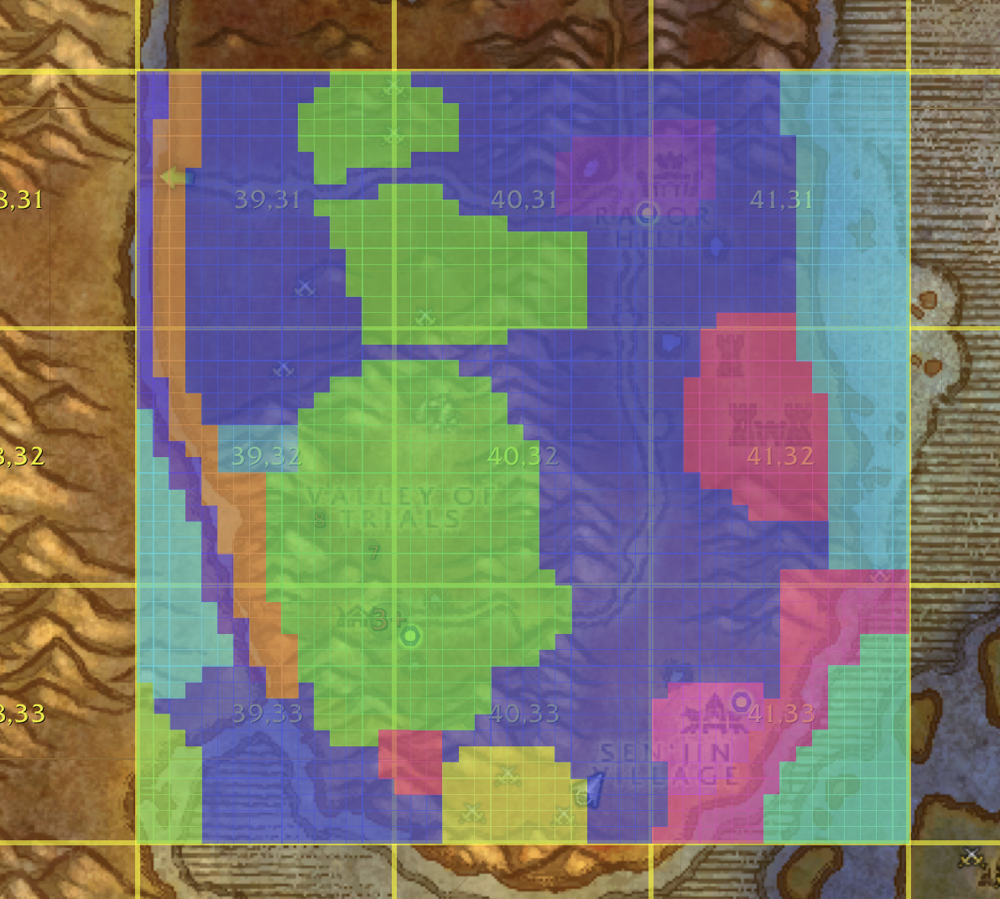

# SpeedrunSkips
A Classic WoW Speedrunning map addon that helps you use the Unstuck Skip and Death Skip mechanics

## Unstuck Skips Mechanics
Uses the Unstuck Character tool made by Blizzard: https://us.support.blizzard.com/en/help/product/wow/586/834/solution

You are teleported to the nearest `Safe Location`. It does not matter if this `Safe Location` is across zones.

`Safe Locations` can be:
- graveyards
- instance portals
- `SoD` instance portals 
  * yes, even though they were made for `SoD`, they exist in classic era now, it is just invisible spaghetti
- `SoD` graveyards 
    * yes, more spaghetti
- other arbitrary locations

## Death Skips Mechanics
there is a server side table called `game_graveyard_zone` that maps the `area-id` you died in to one or more eligible graveyards. If there are multiple eligible graveyards, it picks the closest one. If there was no eligible graveyard, it traverses up your parent zone heirarchy checking each area/zone until it finds an eligible graveyard. The following pseudo code illustrates this:

```
for zone = areaId; zone != 0; zone = ParentAreaID(zone):
    candidates = rows where ghost_zone = zone AND faction in (0, myFaction)
    if candidates not empty:
        choose one (often nearest by distance)
        return that graveyard
```

An Example:

*most* of the graveyards in Durotar are assigned the "parent" zone of Durotar. If we die in the Sen'Jin Village subzone (there are no graveyards assigned to Sen'Jin Village directly) it traverses the subzone hierarchy until it gets to the Durotar zone, and it finds multiple graveyards assigned, and it picks the closest one. If we want the Valley of Trials graveyard to only work for Valley of Trials, and not for anywhere else in Durotar, we just remove its assignment from Durotar and give it the Valley of Trials `area-id`/zone. so now if you die in the Valley of Trials the first check for graveyards only returns the single one in that zone (Valley of Trials has no children zones as well, so dying outside of the zone cannot take you to it). Southfury River has multiple zones. The West side zone (its a long skinny zone that stretches all the way up along the river, shown as dark purple in the picture below) is given a single assignment to the Razor Hill graveyard, so no matter where you die within this zone, it takes you to Razor Hill (it is technically not in Durotar, it is in The Barrens, it just never has to traverse the subzone hierarchy). the Southfury River East side zone (shown in orange in the picture below), on the other hand, has no assignments so it defaults to its parent zone of Durotar, so it puts you to the closest eligible Durotar graveyard (Valley of Trials not being one of them). 


## Contributing
### ADT Files
Because these files are plentiful and large, we do not add these to the repo. You will have to download them yourself. See the later section about them to learn how.

### Generated Files
`Data/Azeroth_tiles.lua` and `Data/Kalimdor_tiles.lua`
- a dictionary where the key is the grid index of the adt block/tile and the value is all of the `area-id`s in that adt block/tile

`Data/AreaInfo.lua`
- a dictionary where the key is the `area-id` and the values are useful info like what color to draw, if it gives exploration xp, and its parent zone/area

`Data/AreaHierarchy.lua`
- a dictionary where the key is the root `area-id` and the values are all the areas/zones that are children to it

`Data/MapToArea.lua`
- a dictionary of `map-id`s to its root `area-id`

To generate the files:
```
cargo run
```

### Resources
`adt` files:
- these are WoW client game files that segment the entire world into small `chunks`, and each `chunk` is assigned an `area-id`
  - depending on what `chunk` your character is standing in will determine what area/zone appears above your minimap
    - a `chunk` is 33 yards wide. to give an idea, it takes around 5 seconds to run that length
  - grabbed from a `v1.12` private server's game client and used an extractor tool to get them https://github.com/Kruithne/wow.export
    - modern WoW uses the `CASC` format, and older private servers use the `MPQ` format
      - we had a hard time getting them from the modern game client, so we used the older private servers, but they should be the same

`UiMap.1.15.8.64907.csv`:
- used to coorelate `map-id`s to `area-id`s
  - when a the world map is open the `map-id` tells us what zone it is looking at
  - downloaded from https://wago.tools/db2/UiMap?build=1.15.8.64907
    
`WorldSafeLocs.csv`:
- used to get the `graveyard-id`s for various locations
  - `graveyard-id`s are used for deathskips
    - a given `area-id` (AKA a zone) is assigned a `graveyard-id` which allows a player to spawn at the given graveyard when they die
  - grabbed from a `v1.12` wow clients encoded game files
    - use an MPQ viewer to find the file: https://github.com/Kruithne/wow.export
    - is going to have inconsistencies compared to the current `v1.15x` version of classic WoW

`unstucks.json`:
- a list of non-graveyard locations that count as elligible locations where the Unstuck tool can teleport you to
- grabbed from the `LogoutSkips` addon https://github.com/aaronma37/LogoutSkips
  - is originally `v1.12`, but community efforts in @Kamisayo's discord has updated it with additional `v1.15x` locations

`gyClassic.json`:
- a list of graveyard locations that count as elligible locations where you can spawn at after dying
- grabbed from the `LogoutSkips` addon https://github.com/aaronma37/LogoutSkips
  - is originally `v1.12`, but community efforts in @Kamisayo's discord has updated it with additional `v1.15x` locations

`AreaTable.1.15.8.64097.csv`:
- used to know the `area-id` (AKA zone) hierarchy (Valley of Trials is a child to Durotar)
- used to know if a zone gives discovery xp by reading the `ExplorationLevel` value
- downloaded from https://wago.tools/db2/AreaTable?build=1.15.8.64907

`game_graveyard_zone.sql`:
- a collection of sql migrations for the `game_graveyard_zone` table that the `vmangos` team have implemented that assign `graveyard-id`s to `area-id`s
- grabbed from the various migrations in https://github.com/vmangos/core/tree/development/sql

`db_dump.sql`:
- the resulting `game_graveyard_zone` sql table after the various migrations have been ran, resulting in the complete set of `graveyard-id`s to `area-id`s coorelations
- grabbed from github actions that the vmangos team automatically runs (the `snapshot-db-dump`, not the `snapshot-db-sqlite-dump`) https://github.com/vmangos/core/actions/runs/20448867445
